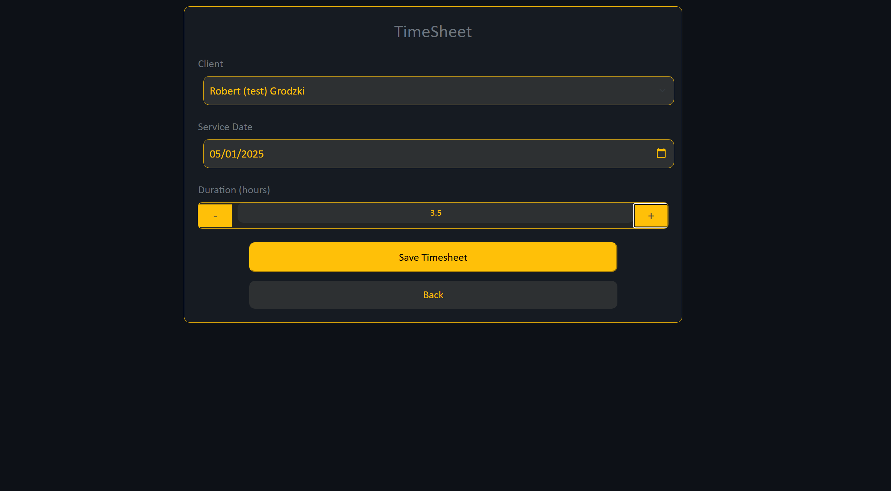
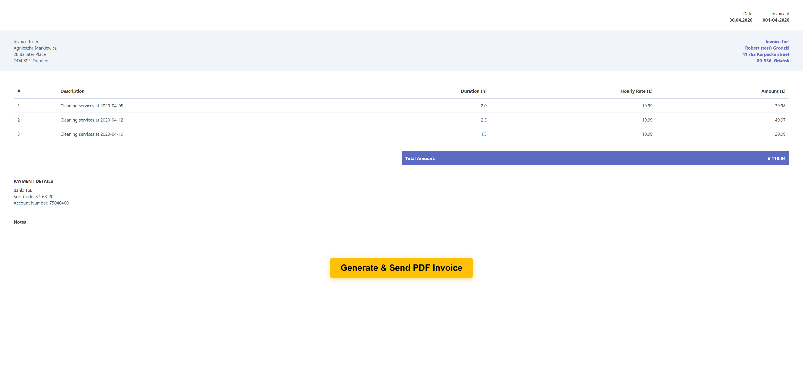
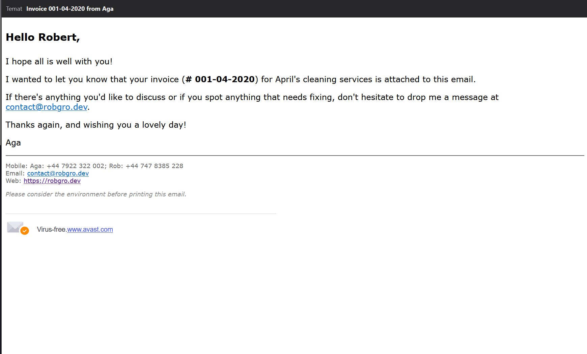
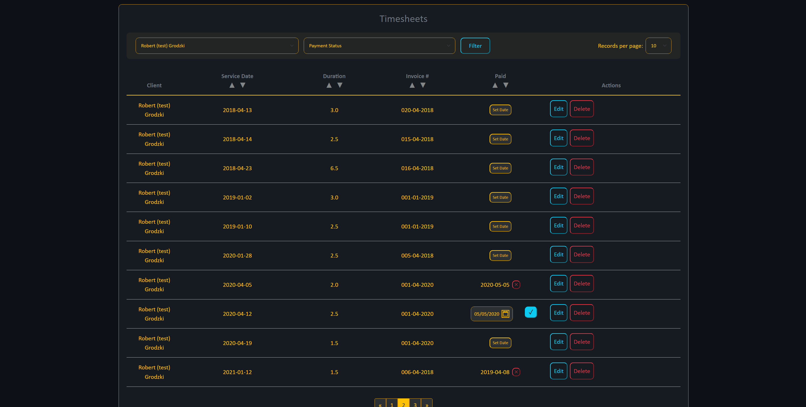
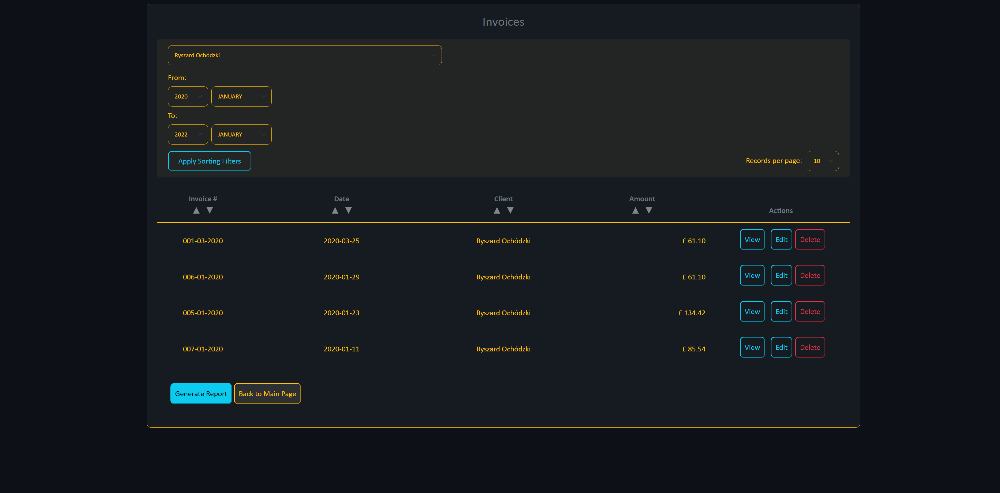
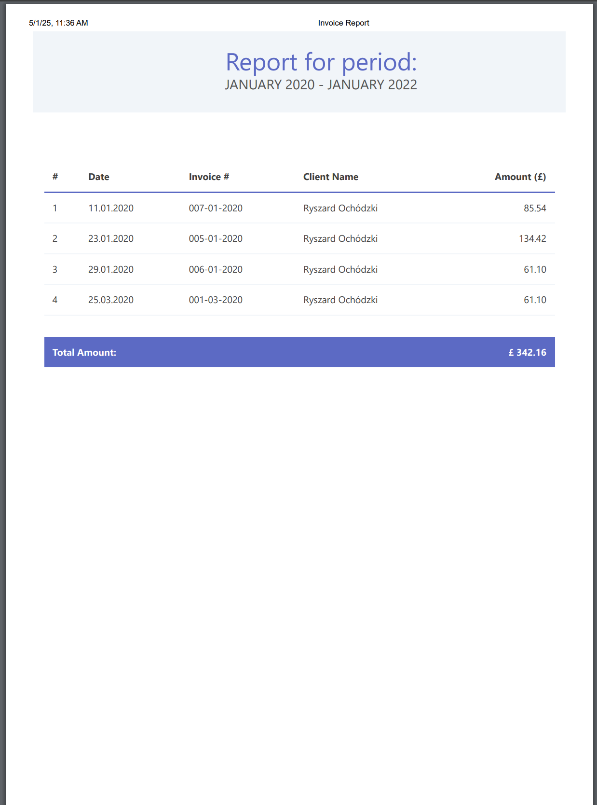
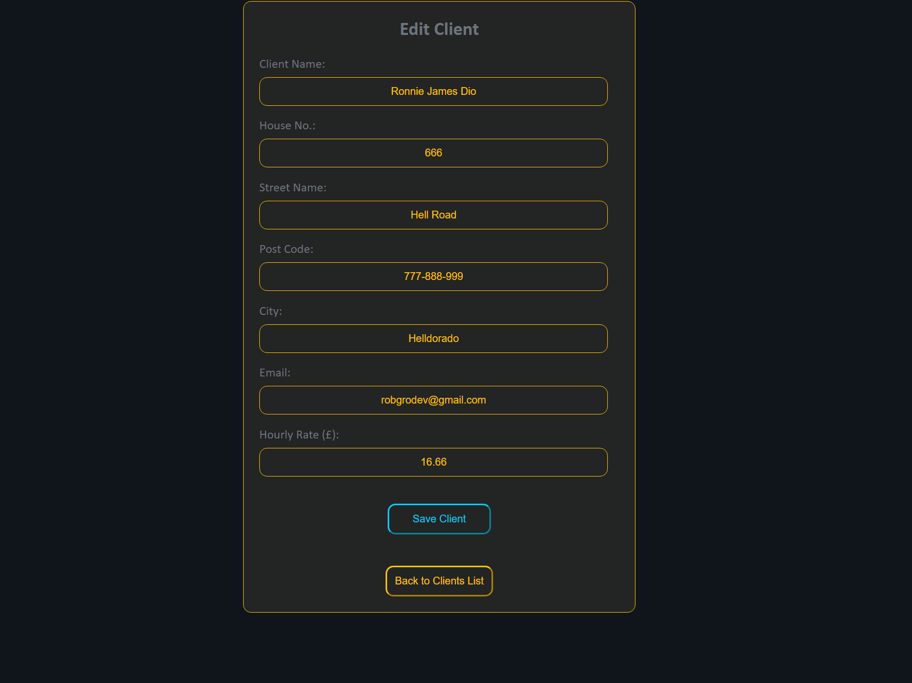
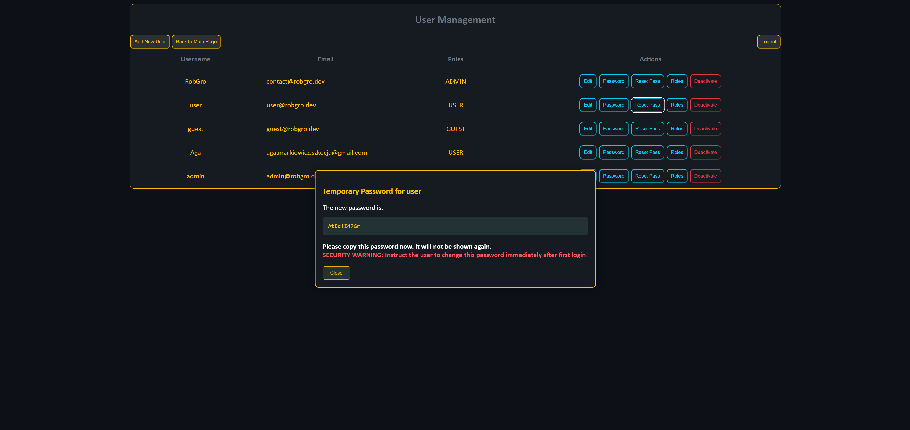

# Application Description

The **Timesheet** application is designed for managing work hours and automatically generating invoices for clients based on the recorded data. It is intended for private and commercial use, mainly for small and medium-sized businesses. The application allows employees to record their worked hours in timesheets, and at the end of the month, invoices are generated for clients and sent via email.

## Main Features:

- **Timesheet Creation**: Employees record their working hours in the application, which allows tracking of worked time.
- **Invoice Generation**: Based on the timesheets, invoices are automatically generated and sent to the client's email.
- **Payment Statuses**: Ability to enter payment statuses for completed services, which allows easy tracking of unpaid invoices.
- **Reporting**: At the end of the fiscal year, reports for accounting are generated, containing all the necessary data for settlements.
- **Security**: The application uses JWT (JSON Web Tokens) for user authorization and security.
- **Role Management**: The application supports various user roles such as ROLE_ADMIN, ROLE_USER, ROLE_GUEST, and manages access permissions to different resources.
- **Integrations**: The application supports integrations with external systems via REST API and supports FTP protocol for uploading and downloading invoices in PDF format.
- **Data Sorting and Filtering**: Ability to sort and filter timesheets and invoices to easily find the data needed for controlling.

## Technologies:

- **Spring Boot**: The application is built using Spring Boot, providing fast development and easy configuration.
- **Thymeleaf**: Used for rendering views and forms in the application.
- **JPA and MariaDB**: The application uses JPA and MariaDB for storing data about timesheets, invoices, and clients.
- **JWT (JSON Web Token)**: For user authorization and managing access to resources within the application.
- **OpenPDF**: Used for generating invoices in PDF format.
- **FTP and Email**: The application supports sending and receiving PDF files via FTP and sending invoices via email.

## Screenshots

Here are some screenshots of the application:

1. **Main window**:
   

2. **Creating a timesheet: Choose client, day of service and duration, and that's it**:
   

3. **Creating an invoice: After selecting a client from the dropdown list, their unpaid timesheets and hourly rate will appear. The program calculates the amounts for individual timesheets, as well as the total amount for all selected timesheets. (You don't have to issue invoices for all timesheets at once)**:
   

4. **Final verification of all data, PDF generation, and sending to the client**:
   

5. **Email to the client: The invoice entity retrieves the client's name, invoice number, and billing period**:
   

6. **PDF invoice**:
   

7. **Timesheet summary: Showing the addition of a paid amount for the completed service**:
   

8. **Invoice summary**:
   

9. **Report from previously filtered invoices, the header includes the values used to generate the summary**:
   

10. **Client editing form**:
    

11. **Password reset: Generating a one-time password for the user. After logging in with this password, they must change it to their own new/permanent password**:
    
